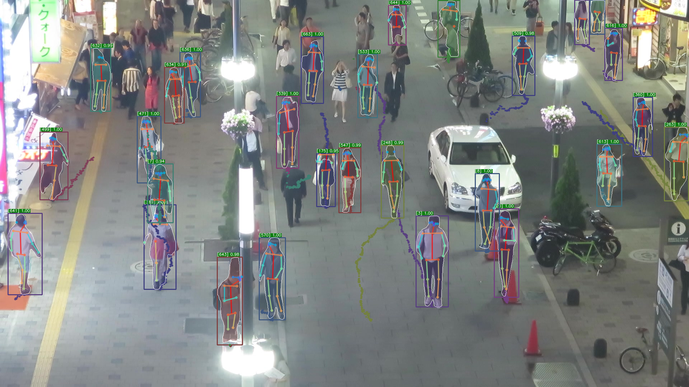
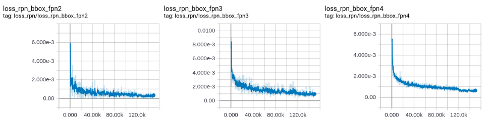
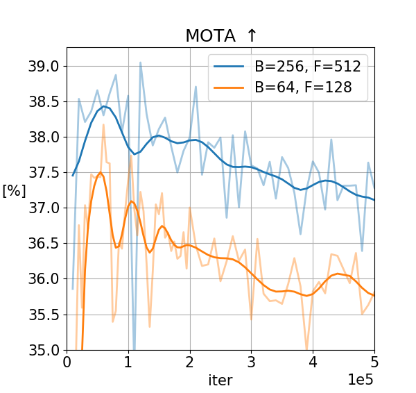
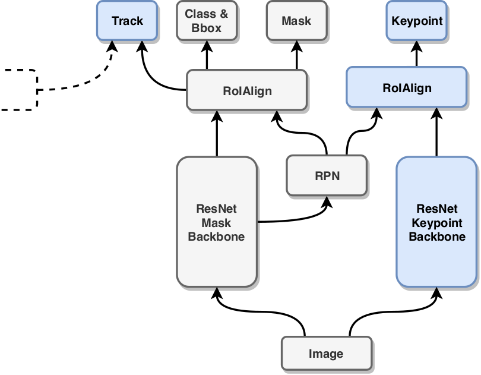
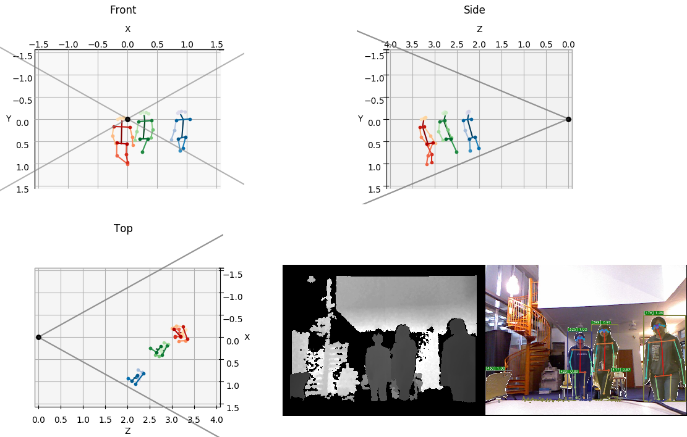

# Tracking Extension

This file documents the tracking extension and multi-task framework
developed as part of Orestis Zambounis' Master Thesis "_Multitask CNN
Architecture for Online 3D Human Pose Estimation and Multi-person
Tracking_".

In the following we provide important command line snippets for
training, validation and inference as a starting point to familiarize
with our extension to the original Detectron framework ([github.com/facebookresearch/Detectron/](https://github.com/facebookresearch/Detectron/)).

<div align="center">
  
  <p>Example multi-task output.</p>
</div>

## Getting Started

### Dataset

The MOT17 Benchmark dataset (or a symlink to it) has to be placed
under `detectron/datasets/data`

Next, we need to convert the MOT ground-truth annotations to a COCO
compatible format:
```
python tools/convert_mot_to_coco.py --dataset-dir path/to/MOT17/dataset
```

If we want to use the proposals provided by the benchmark we need to convert those to a COCO
compatible format using:
```
python tools/convert_mot_detetections_to_proposals.py --dataset-dir path/to/MOT17/dataset
```

### Matlab Engine

In order to run evaluations in python with the provided MOT devkit we need
to install the matlab engine for python. Follow the official instructions at [www.mathworks.com/help/matlab/matlab_external/install-the-matlab-engine-for-python.html](https://www.mathworks.com/help/matlab/matlab_external/install-the-matlab-engine-for-python.html).

### c2board

We can use tensorboard to visualize our training progress. For this we need
to install c2board. Follow the official instructions at [github.com/endernewton/c2board](https://github.com/endernewton/c2board).

## Training

### Config

Set both `MODEL.FASTER_RCNN` and `MODEL.RPN_ONLY` to `True` if training exclusively for tracking. This
will disable class and bounding box regression training. We can
further disable RPN and Faster R-CNN losses by setting `RPN.LOSS_ON`
and `FAST_RCNN.LOSS_ON` to `False`.

### Run training

Finally, execute the training with
```
python tools/train_net.py --cfg path/to/cfg.yaml
```

### Inspection

Inspect the training progress with tensorboard:
```
tensorboard --logdir outputs
```

<div align="center">
  
  <p>Example tensorboard visualization.</p>
</div>

We can further download the tensorboard visualizations as a csv file and plot those with `matplotlib`:

```
python visualize_tensorboard.py --file path/to/file.csv
```

## Validation

### Full sequence validation using MOT metrics

Run validation on all the testing sequences specified in `TEST.DATASETS` to
calculate MOT metrics on all saved models from a specific configuration.
The following command evaluates the sequences specified in `TEST.DATASETS` by interfacing to the MOT devkit in matlab. When using custom proposals we have to set `MODEL.FASTER_RCNN` to `False` in the configuration file.
```
python tools/test_tracking.py --cfg path/to/cfg.yaml proposals eval
```

### MOT metrics visualization

The previous command will write validation results to the evaluation
directory (`outputs/test/...`) which can be visualized using:
```
python --pdb tools/visualize_mot_val.py --eval-dir path/to/evaluation/directory
```

<div align="center">
  
  <p>Example metric visualization: MOTA over training interation.</p>
</div>

## Inference

### Config

Set `MODEL.FASTER_RCNN` to `False` if using custom proposals. Set `MODEL.RPN_ONLY` to `False`.

### Custom image sequence

Simple image sequence inference (visualized results in `outputs/infer_track_sequence`):
```
python tools/infer_track_sequence.py --wts path/to/weights.pkl --cfg path/to/cfg.yaml --im-dir path/to/image/sequence show-track
```

Isolated image pair object associations (visualized results in `outputs/infer_track_pairs`):
```
python tools/infer_track_pairs.py --wts path/to/weights.pkl --cfg path/to/cfg.yaml --im-dir path/to/image/sequence show-track
```

### Multi-task

Merging weights from mulitple files for multi-task inference with a sibling backbone:

```
python tools/infer_track_sequence.py --wts path/to/weights/tracking.pkl path/to/weights/kps.pkl --cfg path/to/multitask-cfg.yaml --preffixes "" sib --im-dir path/to/image/sequence show-track
```

<div align="center">
  
  <p>Example of a sibling backbone for human pose keypoints estimation.
  Additions to the original Mask R-CNN architecture are highlighted in blue.
  Dotted box / arrow indicates features from the previous frame.
</p>
</div>


### Submission

As we are using custom proposals we need to set `MODEL.FASTER_RCNN` to `False` in the configuration file. The following command infers submission results for all the sequences specified in `TEST.DATASETS` and stores the detection files under `outputs/MOT17/`: 
```
python tools/test_tracking.py --cfg path/to/cfg.yaml --model model_iterX.pkl proposals
```

### 3D Keypoints

The following examples use the _Princeton Tracking Benchmark_
for 3D human pose inference. ([tracking.cs.princeton.edu/dataset.html](http://tracking.cs.princeton.edu/dataset.html)).
We define the path to the desired sequence as `PRINCETON_SEQ`.

Uncomment line `238` in `detectron/utils/tracking.py` for custom image sequence sorting for the Princeton Tracking Benchmark.
Run inference on the image sequence:
```
python tools/infer_track_sequence.py --wts path/to/weights/tracking.pkl path/to/weights/kps.pkl --cfg path/to/multitask-cfg.yaml --preffixes "" sib --im-dir "${PRINCETON_SEQ}/rgb" --n-colors 2 --output-dir ${PRINCETON_SEQ}/dets --output-file "${PRINCETON_SEQ}/detections.pkl" all-dets show-track
```

Map keypoints to the depth and transform to world coordinates (saves results to `kps_3d.npy`):
```
python tools/3D_inference/vis_rgbd.py --datadir "${PRINCETON_SEQ}" --dataset princeton --mode 1 --k-size 1 auto-play record-kps no-plot
```

Filter keypoints with a median or gaussian filter:
```
python2 tools/3D_inference/filter_kps.py --kps-3d "${PRINCETON_SEQ}/kps_3d.npy" --output-dir "${PRINCETON_SEQ}" --filter-var 5
```

Visualize using the filtered keypoints:
```
python tools/3D_inference/vis_rgbd.py --datadir "${PRINCETON_SEQ}" --dataset princeton --mode 1 --kps-3d "${PRINCETON_SEQ}/kps_3d.npy" auto-play
```

<div align="center">
  
  <p>Example 3D world-frame mapping of the human pose keypoints.</p>
</div>

## Other

### Network graph visualization

Simple:
```
python tools/visualize_net.py --cfg path/to/cfg.yaml
```

Include blob shapes:
```
python tools/visualize_net.py --cfg path/to/cfg.yaml --model path/to/weights.pkl shapes
```

<div align="center">
  
  <p>Excerpt from an example of a network graph visualization
  of the architecture in training mode.</p>
</div>

### Pre-compute blobs

Save selected blobs to storage to possibly speed up training time.
Please refer to the following issue fist before considering using this script: [github.com/facebookresearch/Detectron/issues/808](https://github.com/facebookresearch/Detectron/issues/808).

Adapted from `scripts/save_tracking_blobs.sh`:

```
for seq in "02" "04" "05" "09" "10" "11" "13"; do
    python tools/save_blobs.py --wts path/to/weights.pkl --cfg path/to/cfg.yaml --blobs [blob-list] --output-dir path/to/output/${seq}/ --dataset mot17_train_frcnn_${seq}
done;
```

### Unit Tests

Test tracking specific operations, losses and outputs with:

```
python detectron/tests/${test}.py
```
