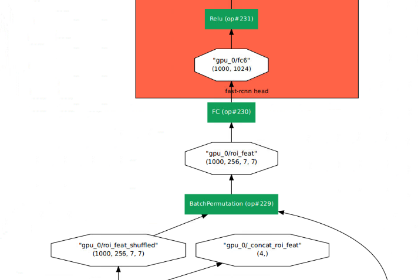

# Tracking Extension

This file documents the tracking extension and multi-task framework
developed as part of Orestis Zambounis' Master Thesis "_Multitask CNN
Architecture for Online 3D Human Pose Estimation and Multi-person
Tracking_".

In the following we provide important command line snippets for
training, validation and inference as a starting point to familiarize
with our extension to the original Detectron framework ([github.com/facebookresearch/Detectron/](https://github.com/facebookresearch/Detectron/)).

<div align="center">
  
  <p>Example multi-task output.</p>
</div>

## Training

### MOT Dataset

The MOT17 Benchmark dataset (or a symlink to it) has to be placed
under `detectron/datasets/data`

Next, we need to convert the MOT ground-truth annotations to a COCO
compatible format:
```
python tools/convert_mot_to_coco.py --dataset-dir path/to/MOT17/dataset
```

### Config

Set both `MODEL.FASTER_RCNN` and `MODEL.RPN_ONLY` to `True` if training exclusively for tracking. This
will disable class and bounding box regression training. We can
further disable RPN and Faster R-CNN losses by setting `RPN.LOSS_ON`
and `FAST_RCNN.LOSS_ON` to `False`.

### Run training

Finally, run the training with
```
python tools/train_net.py --cfg path/to/cfg.yaml
```

### Inspection

Inspect the training loss using
```
tensorboard --logdir outputs
```

### Pre-compute blobs

Save selected blobs to storage to possibly speed up training time.

Adapted from `scripts/save_tracking_blobs.sh`:

```
for seq in "02" "04" "05" "09" "10" "11" "13"; do
    ipython2 --pdb tools/save_blobs.py -- --wts path/to/weights/file --cfg path/to/cfg --blobs [blob-list] --output-dir path/to/output/${seq}/ --dataset mot17_train_frcnn_${seq}
done;
```

## Validation

### Full sequence validation using MOT metrics

Run validation on the full sequences to calculate MOT metrics on all
saved models from a specific configuration:
```
python tools/test_tracking.py ---cfg path/to/config.yaml proposals eval
```

### MOT metrics visualization

The previous command will write validation results to the model
directory which can be visualized using:
```
python --pdb tools/visualize_mot_val.py --model-dir outputs/test/.../generalized_rcnn/
```

## Inference

### Config

Set `MODEL.FASTER_RCNN` to `False` if using custom proposals. Set `MODEL.RPN_ONLY` to `False`.

### Custom image sequence

Simple image sequence inference:
```
python tools/infer_track_sequence.py --wts path/to/weights --cfg path/to/config --im-dir path/to/image/sequence --n-colors 10 show-track
```

Pairwise image inference (isolated image pair object associations):
```
python tools/infer_track_pairs.py --wts path/to/weights --cfg path/to/config --im-dir path/to/image/sequence show-track
```

### Multi-task

Merging weights from mulitple files for multi-task inference with a sibling backbone:

```
python2 tools/infer_track_sequence.py --wts path/to/weights/tracking path/to/weights/kps --cfg configs/tracking/siamese-cfg.yaml --preffixes "" sia --im-dir path/to/image/sequence --n-colors 10 show-track
```

<div align="center">
  
  <p>Example of a sibling backbone for human pose keypoints estimation.
  Additions to the original Mask R-CNN architecture are highlighted in blue.
  Dotted box / arrow indicates features from the previous frame.
</p>
</div>


### Evaluate MOT sequence

First, we convert proposals provided by the MOT benchmark to a COCO
compatible format using:
```
python tools/convert_mot_detetections_to_proposals.py --dataset-dir path/to/MOT17/dataset
```

Custom proposals (`MODEL.FASTER_RCNN` must be set to `False` in the config): 
```
python tools/test_tracking.py --cfg path/to/config.yaml --model model_iterX.pkl proposals eval
```

### 3D Keypoints

The following example use the _Princeton Tracking Benchmark_
for 3D human pose inference. ([tracking.cs.princeton.edu/dataset.html](http://tracking.cs.princeton.edu/dataset.html)).

Run inference on custom image sequence:
```
python tools/infer_track_sequence.py --wts path/to/weights/tracking path/to/weights/kps --cfg configs/tracking/cfg-siamese.yaml --preffixes "" sia --im-dir .../Princeton\ Tracking\ Benchmark/EvaluationSet/${folder}/rgb --n-colors 2 --output-dir .../Princeton\ Tracking\ Benchmark/EvaluationSet/${folder}/dets --output-file .../Princeton\ Tracking\ Benchmark/EvaluationSet/${folder}/detections.pkl all-dets show-track
```

Map keypoints to the depth and transform to world coordinates:
```
python tools/3D_inference/vis_rgbd.py --datadir .../Princeton\ Tracking\ Benchmark/EvaluationSet/three_people/ --dataset princeton --mode 1 --shrink-factor 1 --k-size 1 --kps-3d .../Princeton\ Tracking\ Benchmark/EvaluationSet/three_people/kps_3d.npy auto-play record-kps
```

Filter keypoints:
```
python2 tools/3D_inference/filter_kps.py --kps-3d .../Princeton\ Tracking\ Benchmark/EvaluationSet/three_people/kps_3d.npy --output-dir .../Princeton\ Tracking\ Benchmark/EvaluationSet/three_people/ --filter median --filter-var 5
```

Visualize using the filtered keypoints:
```
python tools/3D_inference/vis_rgbd.py --datadir .../Princeton\ Tracking\ Benchmark/EvaluationSet/three_people/ --dataset princeton --kps-3d ~/datasets/Princeton\ Tracking\ Benchmark/EvaluationSet/three_people/kps_3d.npy
```

<div align="center">
  
  <p>Example 3D world-frame mapping of the human pose keypoints.</p>
</div>

## Other

### Network graph visualization

Simple:
```
python tools/visualize_net.py --cfg path/to/cfg.yaml
```

Include blob shapes:
```
python tools/visualize_net.py --cfg path/to/cfg.yaml shapes
```

<div align="center">
  
  <p>Excerpt from an example of a network graph visualization
  of the architecture in inference mode.</p>
</div>

### Pre-computation of blobs

Pre-compute constant blobs to potentially speed up training time:
```
python tools/save_blobs.py
```
